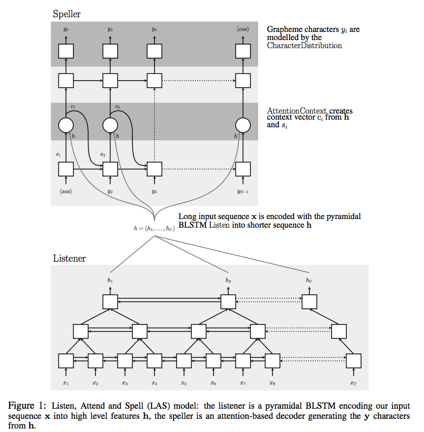
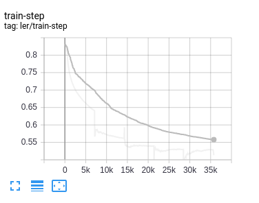
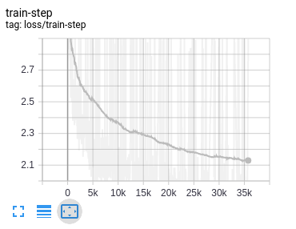

## LAS-Pytorch

This is my pytorch implementation for the [Listen, Attend and Spell](https://arxiv.org/abs/1508.01211v2) (LAS) google ASR deep learning model. I used both the mozilla [Common voice](https://voice.mozilla.org/en/datasets) dataset and the [LibriSpeech](https://www.openslr.org/12) dataset.



The feature transformation is done on the fly while loading the files thanks to torchaudio.

## Results

This are the LER (letter error rate) and loss metrics for 4 epochs of training with a considerably smaller architecture since my gpu didnt have enough memory. Listener had 128 neurons and 2 layers while the Speller had 256 neurons with 2 layers as well.

We can see how the model is able to learn from the data we are feeding to it but it still needs more training and a proper architecture.
|  Letter error rate  |         Loss          |
| :-----------------: | :-------------------: |
|  |  |


If we try to predict a sample of audio the results now look like:

`true_y`: ['A', 'N', 'D', '', 'S', 'T', 'I', 'L', 'L', '', 'N', 'O', '', 'A',
       'T', 'T', 'E', 'M', 'P', 'T', '', 'B', 'Y', '', 'T', 'H', 'E', '',
       'P', 'O']

`pred_y`:['A', 'N', 'D', '', 'T', 'H', 'E', 'L', 'L', '', 'T', 'O', 'T', 'M',
       '', 'T', 'E', 'N', 'P', 'T', '', 'O', 'E', '', 'T', 'H', 'E', '',
       'S', 'R']

Only the conjunction are being properly indentified, this led us to think the model needs higher training times to be able to learn more specific words.

#Will train more and update results here, still looking for credits in cloud compute

## How to run it

### Requirements
Code is setup to run with both the mozilla [Common voice](https://voice.mozilla.org/en/datasets) dataset and the [LibriSpeech](https://www.openslr.org/12) dataset. If you want to run the code you should download the datasets and extract them under data/ or run the script `utils/download_data.py` which will download it and extract it in the following format:

### Data
```
data
├── LibriSpeech
│   ├── BOOKS.TXT
│   ├── CHAPTERS.TXT
│   ├── dev-clean/
│   ├── LICENSE.TXT
│   ├── README.TXT
│   ├── SPEAKERS.TXT
│   ├── test-clean/
│   └── train-clean-100/
└── mozilla
    ├── dev.tsv
    ├── invalidated.tsv
    ├── mp3/
    ├── other.tsv
    ├── test.tsv
    ├── train.tsv
    └──  validated.tsv
```

So run
```

#Remove flags if you want to avoid download that specific dataset
$ python utils/download_data.py --libri --common
```

And run the following commands to process and collect all files.

```
#Still in utils/
$ python utils/prepare_librispeech.py --root $ABSOLUTEPATH TO DATASET
$ python uitls/prepare_common-voice.py --root $ABSOLUTEPATH TO DATASET
```
This will create a `processed/` folder inside each of the datassets containing the csvs with teh data neccesary to train along vocabulary and word count files.

### Training
Execute the train script along with the yaml config file for the desired dataset.
```
$ python train.py --config_path config/librispeech-config.yaml
# Or
$ python train.py --config_path config/common_voice-config.yaml
```

Loss and lert will be logged to the `runs/` folder, you can check them by running tensoboard in the root directory.
