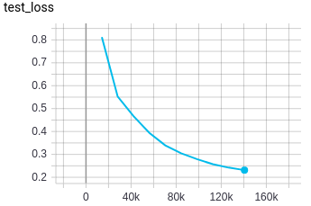
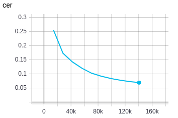
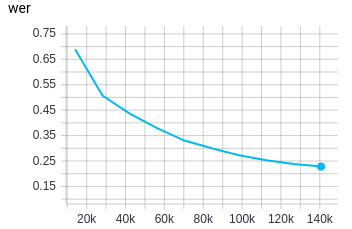

---

<div align="center">

# DeepSpeech-pytorch

</div>

End-to-end speech recognition model in PyTorch with DeepSpeech model

## How to run
First, install dependencies
```bash
# clone project
git clone https://github.com/jiwidi/DeepSpeech-pytorch

# install project
cd DeepSpeech-pytorch
pip install -e .
pip install -r requirements.txt
 ```
Ready to run! execute:
```python
python train.py #Will run with default parameters and donwload the datasets in the local directory
```

Tensorboard logs will be saved under the `runs/` folder

## The model
The model is a variation of DeepSpeech 2 from the guys at [assemblyai](https://www.assemblyai.com/)

```py
DeepSpeech(
  (cnn): Conv2d(1, 32, kernel_size=(3, 3), stride=(2, 2), padding=(1, 1))
  (rescnn_layers): Sequential(
    (0): ResidualCNN(
      (cnn1): Conv2d(32, 32, kernel_size=(3, 3), stride=(1, 1), padding=(1, 1))
      (cnn2): Conv2d(32, 32, kernel_size=(3, 3), stride=(1, 1), padding=(1, 1))
      (dropout1): Dropout(p=0.1, inplace=False)
      (dropout2): Dropout(p=0.1, inplace=False)
      (layer_norm1): CNNLayerNorm(
        (layer_norm): LayerNorm((64,), eps=1e-05, elementwise_affine=True)
      )
      (layer_norm2): CNNLayerNorm(
        (layer_norm): LayerNorm((64,), eps=1e-05, elementwise_affine=True)
      )
    )
    (1): ResidualCNN(
      (cnn1): Conv2d(32, 32, kernel_size=(3, 3), stride=(1, 1), padding=(1, 1))
      (cnn2): Conv2d(32, 32, kernel_size=(3, 3), stride=(1, 1), padding=(1, 1))
      (dropout1): Dropout(p=0.1, inplace=False)
      (dropout2): Dropout(p=0.1, inplace=False)
      (layer_norm1): CNNLayerNorm(
        (layer_norm): LayerNorm((64,), eps=1e-05, elementwise_affine=True)
      )
      (layer_norm2): CNNLayerNorm(
        (layer_norm): LayerNorm((64,), eps=1e-05, elementwise_affine=True)
      )
    )
  )
  (fully_connected): Linear(in_features=2048, out_features=512, bias=True)
  (birnn_layers): Sequential(
    (0): BidirectionalGRU(
      (BiGRU): GRU(512, 512, batch_first=True, bidirectional=True)
      (layer_norm): LayerNorm((512,), eps=1e-05, elementwise_affine=True)
      (dropout): Dropout(p=0.1, inplace=False)
    )
    (1): BidirectionalGRU(
      (BiGRU): GRU(1024, 512, bidirectional=True)
      (layer_norm): LayerNorm((1024,), eps=1e-05, elementwise_affine=True)
      (dropout): Dropout(p=0.1, inplace=False)
    )
    (2): BidirectionalGRU(
      (BiGRU): GRU(1024, 512, bidirectional=True)
      (layer_norm): LayerNorm((1024,), eps=1e-05, elementwise_affine=True)
      (dropout): Dropout(p=0.1, inplace=False)
    )
  )
  (classifier): Sequential(
    (0): Linear(in_features=1024, out_features=512, bias=True)
    (1): GELU()
    (2): Dropout(p=0.1, inplace=False)
    (3): Linear(in_features=512, out_features=29, bias=True)
  )
)
Num Model Parameters 14233053
```
With the following architecture:


## Results
Results of training for 10 epochs show a great potencial. I would like to spend more time finetuning the model and training for longer epochs but I need to purchase cloud computing for that and is out of my scope right now.

Loss
-----

|        Training data        |          Test data           |
| :-------------------------: | :--------------------------: |
|  |  |

Metrics on `test-clean`
-----

| Character error rate CER |  Word error rate WER   |
| :----------------------: | :--------------------: |
|    |  |

### Data pipeline

For testing the model we used the Librispeech dataset and performed a MelSpectogram followed by FrequencyMasking to mask out the frequency dimension, and TimeMasking for the time dimension.

```py
train_audio_transforms = nn.Sequential(
    torchaudio.transforms.MelSpectrogram(sample_rate=16000, n_mels=128),
    torchaudio.transforms.FrequencyMasking(freq_mask_param=15),
    torchaudio.transforms.TimeMasking(time_mask_param=35)
)
```


